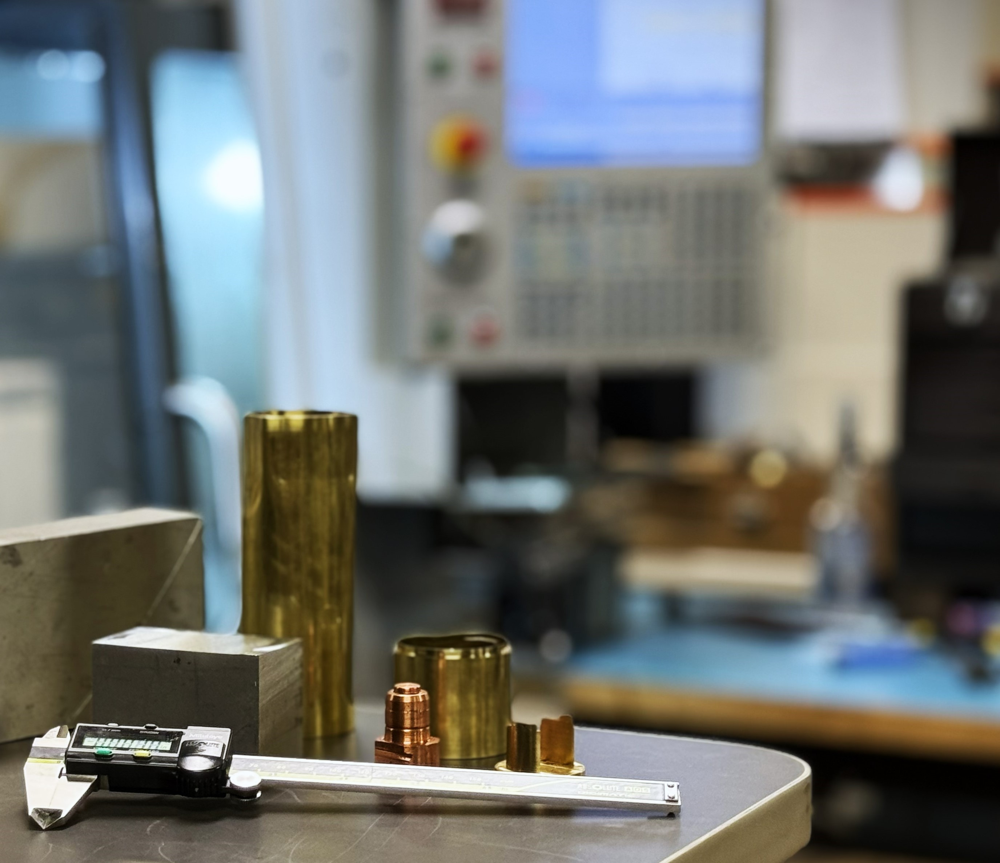

---

## Services & Capabilities
We provide high-precision machining and design assistance for research instrumentation across the UCLA campus.

---

  <a href="{{ '/training' | relative_url }}" class="ucla-card-link">
    

      <h3>Training</h3>
      <ul>
        <li>Shop Safety & Orientation</li>
        <li>Mill & Lathe Certification</li>
      </ul>
    

  </a>

  <a href="{{ '/3d-printing' | relative_url }}" class="ucla-card-link">
    

      <h3>3D Printing / Prototyping</h3>
      <ul>
        <li>FDM & SLA Printing</li>
        <li>Rapid Design Iteration</li>
      </ul>
    

  </a>

  <a href="{{ '/cnc-milling' | relative_url }}" class="ucla-card-link">
    

      <h3>CNC Milling</h3>
      <ul>
        <li>Precision Machining</li>
        <li>Research-Grade Components</li>
      </ul>
    

  </a>

---

## Start a Project
To submit a work order, please fill out our [Project Request Form](URL-HERE) or visit us in **Kaplan Hall, Room A08**.

## 3D print request
Fill out and upload your file(s) using [This form](URL-Here) 

*.3mf, .stl, .oltp, .stp, .step, .svg, .amf, .obj files supported* 

## How to Request Access
You can request after hours and weekend access using [This Form](URL-HERE)
*Shop Supervisor and PI sign-off required* 

## Shop Rates
[**View Shop Rates**](/rates)

---

## Location & Hours
**Kaplan Hall, Room A08** 
**Monday – Friday:** 7:00 AM – 3:30 PM 
**Closed:** 12:00 PM – 1:00 PM (Lunch)

---

## 🔗 Quick Links
[Shop Safety Manual](/safety) | [Equipment List](/equipment) | [Staff Directory](/staff) | [UCLA Physical Sciences](https://www.physicalsciences.ucla.edu)
